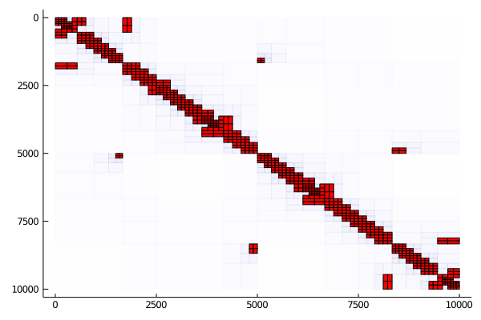

# HMatrices.jl

*A package for assembling and doing algebra with hierarchical matrices with a focus on boundary integral equations* 


## Installation
Install from the Pkg REPL:
```
pkg> add https://github.com/IntegralEquations/HMatrices
```
## Basic usage

The following simple example illustrates how you may use this package to compress Laplace's single layer operators on a circle:
```julia
    using HMatrices, Clusters, Plots, LinearAlgebra
    # create some random points
    N           = 10_000 
    pts         = [(cos(θ),sin(θ)) for θ in range(0,stop=2π,length=N)]
    # make a cluster tree
    clustertree = ClusterTree(pts)
    # then a block cluster tree
    blocktree   = BlockTree(clustertree,clustertree)
    # create your matrix
    f(x,y)      =  x==y ? 0.0 : -1/(2π)*log(norm(x-y)) # Laplace single layer kernels in 2d
    M           = [f(x,y) for x in clustertree.data, y in clustertree.data]
    # compress it
    H           = HMatrix(M,blocktree)
```
Many of the steps above accept keyword arguments or functors for modifying their default behavior.

Often one cannot assemble the full matrix. In this case the `LazyMatrix` type is useful:
```julia
    L = LazyMatrix(f,clustertree.data,clustertree.data)
    H = HMatrix(L,blocktree)
```
This is just like the matrix we build `M`, but it computes the entries *on demand* and does not store them. To see the data sparse structure of the hierarchical matrix the package includes a `Plots` recipe so that you can do `plot(H)` to see something like the following image:


